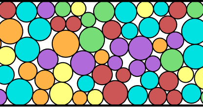
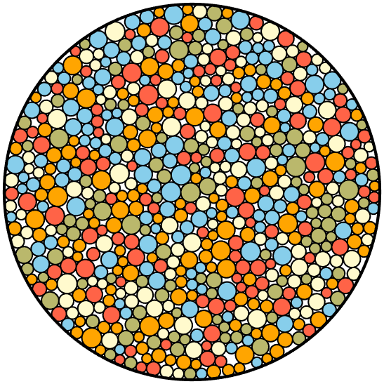
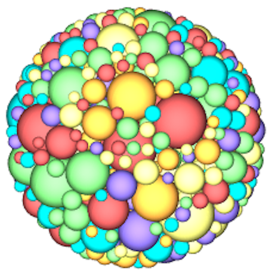
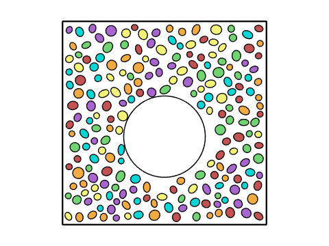
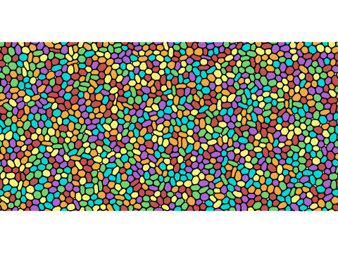
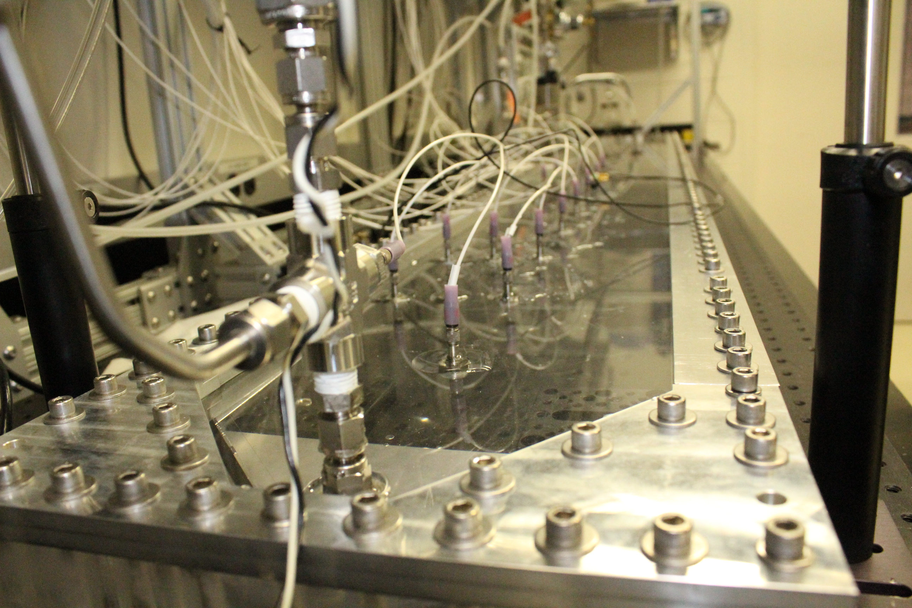
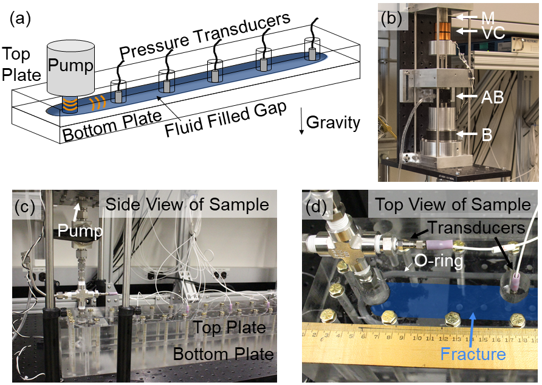

  <!-- Left column: photo + contact info -->
  

    
    

      
<strong>Physicist & Researcher</strong>

      
Former ExxonMobil Research Scientist

      
Post Doc, UCSB

      
PhD, Emory University

      
BSc, Rochester Institute of Technology

      <a href="https://www.linkedin.com/in/kenneth-desmond-7461257/">🔗 LinkedIn</a>
      <a href="https://scholar.google.com/citations?user=KqSFejcAAAAJ&hl=en">🎓 Google Scholar</a>
    

  

  <!-- Right column: welcome & about -->
  

    <h2>👋 Welcome</h2>
    

      I’m an independent researcher pursuing research in soft matter physics and acoustic sensing.
    

    <ul>
      <li>Particle-size distribution effects in RCP</li>
      <li>Acoustic-based navigation & sensing (“BatBot”)</li>
      <li>Deformable-particle models for soft-matter simulations</li>
    </ul>
    
Feel free to explore my code or reach out via GitHub issues!

  

---

## Current Code & Repositories Available

🔗 [GitHub ↗ Random Close Packing Generator](https://github.com/KD-physics/RCPGenerator)  

🔗 [GitHub ↗ Squishy Particle Simulator](https://github.com/KD-physics/Squishy-Particle-Simulator) 

---

## Current Research

### N-Dimensional Random Close Packing Generator  
🔗 [GitHub ↗](https://github.com/KD-physics/RCPGenerator)   
A fast, flexible toolkit (C++, MATLAB, Python) for generating **random close packings**, **dense packings**, and **jammed states** of spheres in 2–N dimensions.  

|  |  |  |  |
|:---------------------------:|:---------------------------:|:---------------------------:|:---------------------------:|
| 2D Confined Packing | Dense packing confined within circular container                  | Cylindrically confined packing with upper and lower hard boundaries.                   | Spherically confined packing.                  |

### Squishy Particle Simulator  
🔗 [GitHub ↗](https://github.com/KD-physics/Squishy-Particle-Simulator) 
A MATLAB-based 2D deformable-polygon model for “squishy” particles. Includes core engine, example scripts, and GIFs showcasing deformation and flow.  

|  |  |  |
|:---------------------------:|:---------------------------:|:---------------------------:|
| Deformable ellipses falling under gravity | Fun couette geometry  | Simple shear                  | 

---

## Prior Research

### Wave Propagation in Fractures

Generating monitoring acoustic waves in synthetic fractions. | [Reasearch Overview](KrauklisWaves/) | 🔗 [Link to publication ↗](https://www.sciencedirect.com/science/article/abs/pii/S0045782521004679)

  &nbsp;
  

---

## 📚 Publications & Patents

### Publications

| #  | Title                                                                                                                                                             | Year |
| -- | ----------------------------------------------------------------------------------------------------------------------------------------------------------------- | :--: |
| 12  | **Clogging and avalanches** in quasi-2D emulsion hopper flow *X. Hong, K.W. Desmond, D. Chen, E.R. Weeks.* Phys. Rev. E 105(1), 014603                         | 2022 |
| 11  | **3D GFEM for wave propagation** in fluid-filled fractures *N. Shauer, K.W. Desmond, P.A. Gordon, F. Liu, C.A. Duarte.* CMAME 386, 114136                      | 2021 |
| 10  | **Experimental observation of local rearrangements** in dense quasi-2D emulsion flow *D. Chen, K.W. Desmond, E.R. Weeks.* Phys. Rev. E 91(6), 062306           | 2015 |
| 9  | **Dynamics of mussel plaque detachment** *K.W. Desmond, N.A. Zacchia, J.H. Waite, M.T. Valentine.* Soft Matter 11(34), 6832–6839                               | 2015 |
| 8  | **Measurement of stress redistribution** in flowing emulsions *K.W. Desmond, E.R. Weeks.* Phys. Rev. Lett. 115(9), 098302                                      | 2015 |
| 7  | **Influence of particle size distribution** on random close packing of spheres *K.W. Desmond, E.R. Weeks.* Phys. Rev. E 90(2), 022204                          | 2014 |
| 6  | **Rheology of fluidized granular matter** *K.W. Desmond, U. Villa, M. Newey, W. Losert.* Phys. Rev. E 88(3), 032205                                            | 2013 |
| 5  | **Experimental study of forces between quasi-2D emulsion droplets near jamming** *K.W. Desmond, P.J. Young, D. Chen, E.R. Weeks.* Soft Matter 9(12), 3424–3436 | 2013 |
| 4  | **Stress fluctuations in 2D hopper flow** *D. Chen, K.W. Desmond, E.R. Weeks.* Soft Matter 8(40), 10486–10492                                                  | 2012 |
| 3 | **Dynamical heterogeneities near colloidal glass transition** *T. Narumi, S.V. Franklin, K.W. Desmond, M. Tokuyama, E.R. Weeks.* Soft Matter 7(4), 1472–1482   | 2011 |
| 2 | **Random close packing in confined geometries** *K.W. Desmond, E.R. Weeks.* Phys. Rev. E 80(5), 051305                                                         | 2009 |
| 1 | **Jamming of three-dimensional prolate granular materials** *K. Desmond, S.V. Franklin.* Phys. Rev. E 73(3), 031303                                            | 2006 |

### Patents

| # | Title                                                                                                                                                                                      | Year |
| - | ------------------------------------------------------------------------------------------------------------------------------------------------------------------------------------------ | :--: |
| 7 | **Systems and methods for measuring cluster efficiency using broadband tube waves** *B.D. Wheelock, P.A. Gordon, L. Song, K.W. Desmond, Y. Zhang.* US Pat. 12,130,399                   | 2024 |
| 6 | **Estimates of flow velocity with controlled spatio-temporal variations in contrast media properties** *K.W. Desmond, G.L. Hunter.* US Pat. 11,573,108                                  | 2023 |
| 5 | **Method and system for performing wireless ultrasonic communications along tubular members** *T.F. Kinn, X. Yi, S.W. Clawson, M.M. Disko, K.W. Desmond, J.H. Moss.* US Pat. 11,203,927 | 2021 |
| 4 | **Encoded injection of microbubbles to improve flow velocity measurements using cross-correlation technique** *K.W. Desmond, G.L. Hunter.* Meas. Sci. Technol. 32(8), 085302            | 2021 |
| 3 | **Estimating flow velocity in pipes by correlating multi-frequency signals** *K.W. Desmond, G.L. Hunter.* US Pat. App. 16/190,734                                                       | 2019 |
| 2 | **Sensitivity of coda wave interferometry to fluid migration through rock** *K.W. Desmond, J.J. Valenza.* J. Acoust. Soc. Am. 145(2), 1100–1104                                         | 2019 |
| 1 | **Electrode materials with mixed particle sizes** *Z.C. Tim Holme, K. Desmond, W\.A. Hermann, J. Han.* US Pat. 20,150,357,644                                                           | 2015 |

## 🎓 Education

| Degree              | Institution                             |   Year  | Advisor                                                                  |
| ------------------- | --------------------------------------- | :-----: | ------------------------------------------------------------------------ |
| PhD Physics         | Emory University                        |   2012  | [Eric R. Weeks](https://faculty.college.emory.edu/sites/weeks/)          |
| BSc (Physics)       | Rochester Institute of Technology       |   2006  | [Scott V. Franklin](https://www.rit.edu/directory/svfsps-scott-franklin) |
| Postdoctoral Fellow | University of California, Santa Barbara | 2012–14 | [Megan J. Valentine](https://valentine.me.ucsb.edu/)                     |

**Google Scholar profile:**  

🔗 [Google Scholar](https://scholar.google.com/citations?user=KqSFejcAAAAJ&hl=en) 

## 🏷 Connect

*Last updated: 2025-05-23*  

