

<nav class="site-nav">
  Kenneth Desmond
  <a href="#about">About</a>
  <a href="#code">Code</a>
  <a href="#research">Research</a>
  <a href="#prior-research">Prior Work</a>
  <a href="#publications">Publications</a>
  <a href="#education">Education</a>
  <a href="#connect">Connect</a>
</nav>

  <!-- Left column: photo + contact info -->
  

    
    

      
<strong>Physicist & Researcher</strong>

      
Former ExxonMobil Research Scientist

      
Post Doc, UCSB

      
PhD, Emory University

      
BSc, Rochester Institute of Technology

      <a href="https://www.linkedin.com/in/kenneth-desmond-7461257/">🔗 LinkedIn</a>
      <a href="https://scholar.google.com/citations?user=KqSFejcAAAAJ&hl=en">🎓 Google Scholar</a>
    

  

  <!-- Right column: welcome & about -->
  

    <h2>👋 Welcome</h2>
    

      I’m an independent researcher pursuing research in soft matter physics and acoustic sensing.
    

    <ul>
      <li>Particle-size distribution effects in RCP</li>
      <li>Acoustic-based navigation & sensing (“BatBot”)</li>
      <li>Deformable-particle models for soft-matter simulations</li>
    </ul>
    
Feel free to explore my code or reach out via GitHub issues!

  

---

## Current Code & Repositories Available

### Generating Dense Spherical Packings 
🔗 [GitHub ↗ Random Close Packing Generator - Code for densely packing particles](https://github.com/KD-physics/RCPGenerator) | [Link to Mathworks File Exchange ↗](https://www.mathworks.com/matlabcentral/fileexchange/181165-random-close-packing-generator-in-arbitrary-dimensions) | 🔗 [Python Implementation Guide ↗](https://kd-physics.github.io/notes/packing-spheres-python.html) | 🔗 [Run in Colab ↗](https://colab.research.google.com/github/KD-physics/RCPGenerator/blob/main/getting_started.ipynb) - Python, C++, and MATLAB code for generating dense random packings of polydisperse particles in arbitrary dimensions with periodic or hard boundaries. Boundaries may be flat or curved (e.g., spherical), allowing many types of packing geometries. The code can generate packings such as spheres packed in a box, disks packed in a 2D box or circle, and 3D spheres packed in rectangular boxes, spheres, or cylinders. The framework generalizes naturally to higher dimensions and has been tested for sphere packings up to seven dimensions.

### Simulating Squishy 2D Particles with Stiff Perimeters
🔗 [GitHub ↗ Squishy Particle Simulator](https://github.com/KD-physics/Squishy-Particle-Simulator) 

---

## Current Research

### N-Dimensional Random Close Packing Generator  
🔗 [GitHub ↗](https://github.com/KD-physics/RCPGenerator)   
A fast, flexible toolkit (C++, MATLAB, Python) for generating **random close packings**, **dense packings**, and **jammed states** of spheres in 2–N dimensions.  

| 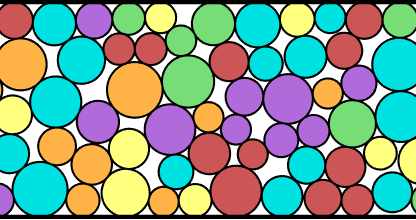 | 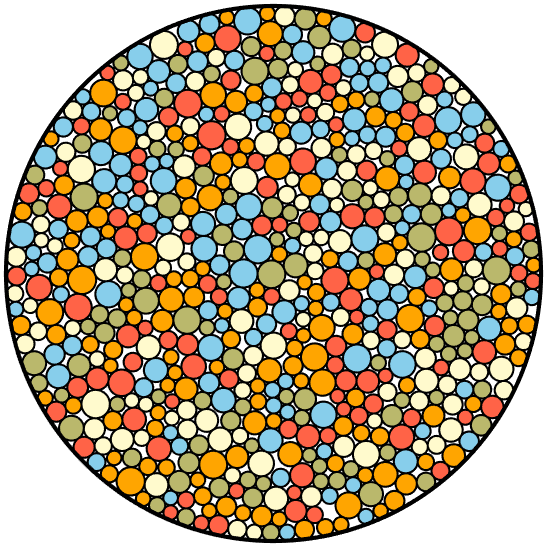 |  | 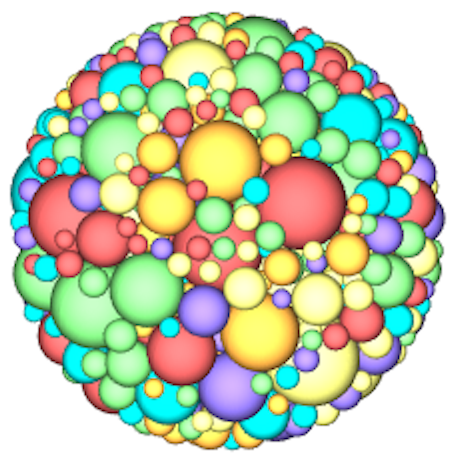 |
|:---------------------------:|:---------------------------:|:---------------------------:|:---------------------------:|
| 2D Confined Packing | Dense packing confined within circular container                  | Cylindrically confined packing with upper and lower hard boundaries.                   | Spherically confined packing.                  |

### Squishy Particle Simulator  
🔗 [GitHub ↗](https://github.com/KD-physics/Squishy-Particle-Simulator) 
A MATLAB-based 2D deformable-polygon model for “squishy” particles. Includes core engine, example scripts, and GIFs showcasing deformation and flow.  

| 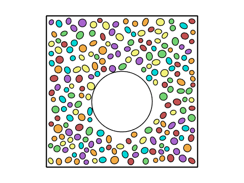 |  | 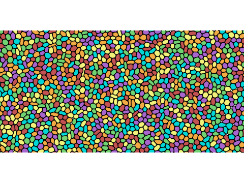 |
|:---------------------------:|:---------------------------:|:---------------------------:|
| Deformable ellipses falling under gravity | Fun couette geometry  | Simple shear                  | 

---

## Prior Research

  <button class="prt-btn prt-on" data-i="0">Emulsions</button>
  <button class="prt-btn" data-i="1">Granular Matter</button>
  <button class="prt-btn" data-i="2">Packing</button>
  <button class="prt-btn" data-i="3">Colloidal Dynamics</button>
  <button class="prt-btn" data-i="4">Wave Mechanics</button>
  <button class="prt-btn" data-i="5">Adhesion</button>

<!-- TAB 0: JAMMING -->

  
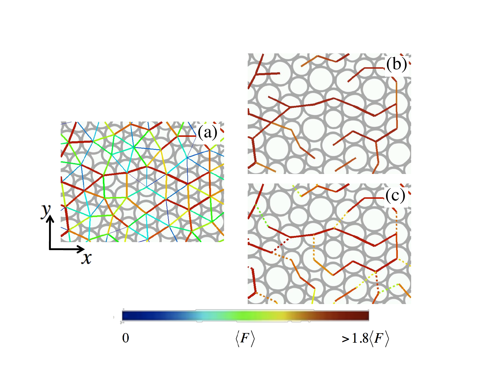

  

    
Forces Between Quasi-2D Emulsion Droplets Near Jamming

    
Contact forces extracted from droplet shape deformation reveal critical scaling of pressure and coordination number near the jamming transition, confirming the spatial randomness of force chain networks.

    <a class="prt-link" href="projects/forces-between-2d-droplets.html">Details →</a>
  

  

  

    
Stress Redistribution in Flowing Dense Emulsions

    
T1 rearrangement events in a flowing quasi-2D emulsion redistribute stress in a quadrupolar pattern, directly linking local particle rearrangements to macroscopic soft glassy flow behavior.

    <a class="prt-link" href="projects/stress-propagation-2d-emulsion.html">Details →</a>
  

<!-- TAB 1: GRANULAR MATTER -->

  
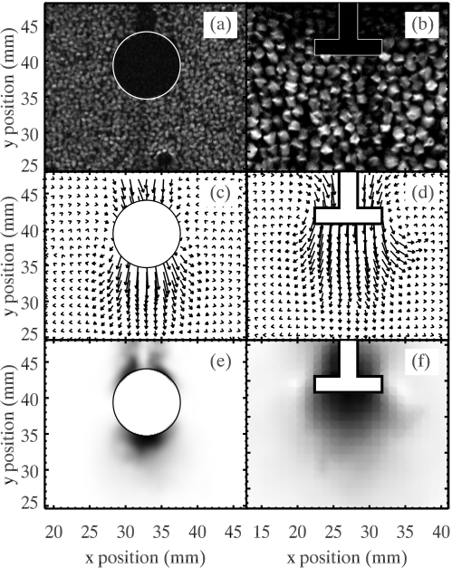

  

    
Penetration of an Object into Granular Media

    
MRI imaging combined with PIV reveals the 3D velocity field of granular material flowing around a penetrating intruder, making internal flow structure visible for the first time.

    <a class="prt-link" href="projects/granular-flow.html">Details →</a>
  

  
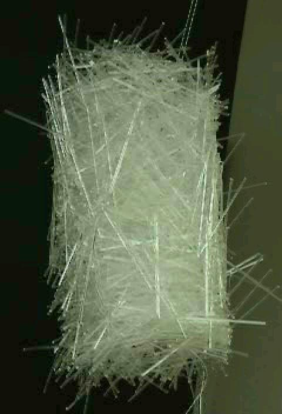

  

    
Jamming of Three-Dimensional Prolate Granular Materials

    
High-aspect-ratio acrylic rods (aspect ratio &gt;35) form self-supporting, wall-free piles through particle entanglement alone, demonstrating a shape-driven jamming transition.

    <a class="prt-link" href="projects/jamming-of-rods.html">Details →</a>
  

  
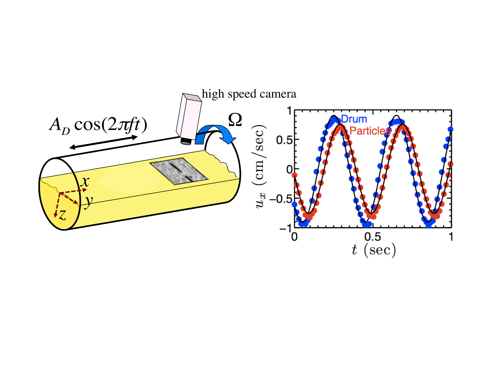

  

    
Rheology of Fluidized Granular Matter

    
Secondary oscillatory forcing applied to a rotating drum of fluidized glass beads reveals non-Newtonian rheology that is well described by the GDR-Midi model at low forcing but breaks down when forcing becomes faster than the material's viscous relaxation time.

    <a class="prt-link" href="projects/granular-rheology.html">Details →</a>
  

<!-- TAB 2: PACKING -->

  
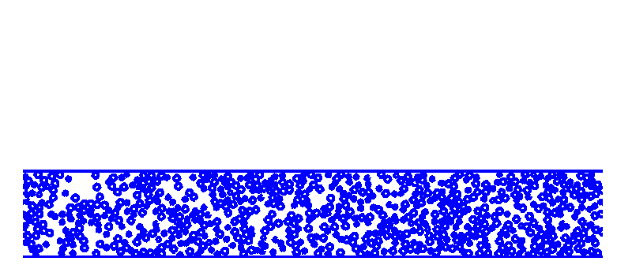

  

    
Random Close Packing Algorithm

    
An iterative swell–contract–minimize particle packing algorithm generates random close packings of 2D hard disks and 3D hard spheres. The animation shows a packing evolving from a random start to a jammed configuration.

    <a class="prt-link" href="projects/rcp-algorithm.html">Details →</a>
  

  
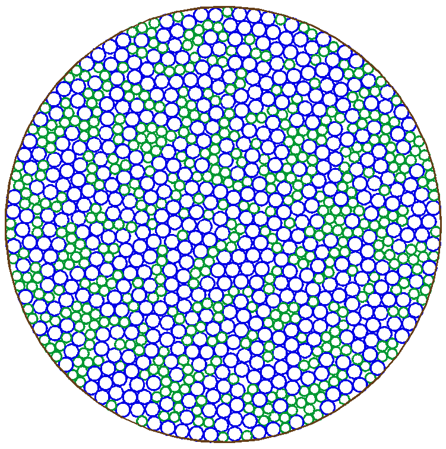

  

    
Random Close Packing in Confined Geometries

    
Hard-wall boundaries alter packing structure near container walls. An extended algorithm generates confined RCPs and quantifies the wall-induced layering effect on local packing fraction.

    <a class="prt-link" href="projects/confined-rcp.html">Details →</a>
  

  
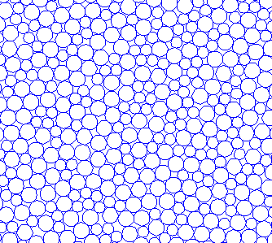

  

    
Influence of Particle Size Distribution on RCP

    
Large-scale packing simulations map how size-distribution shape (width, skewness) affects the achievable hard-sphere packing fraction, yielding quantitative scaling laws for polydisperse granular and colloidal systems.

    <a class="prt-link" href="projects/rcp-polydispersity.html">Details →</a>
  

  
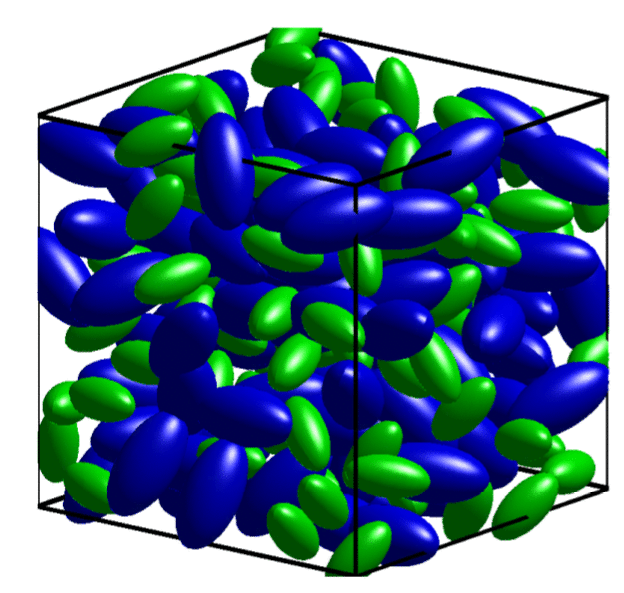

  

    
Ellipsoidal Packing

    
Dense random packings of ellipsoidal particles exceed the ~64% hard-sphere packing fraction limit. Aspect ratio and polydispersity effects on packing fraction and structure were systematically characterized.

    <a class="prt-link" href="projects/ellipsoidal-packing.html">Details →</a>
  

<!-- TAB 3: COLLOIDAL DYNAMICS -->

  
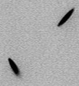

  

    
Ellipsoidal Diffusion Microrheology

    
Measuring both translational and rotational Brownian fluctuations of ellipsoidal tracers simultaneously determines the viscoelastic modulus without requiring precise knowledge of particle dimensions.

    <a class="prt-link" href="projects/ellipsoidal-diffusion.html">Details →</a>
  

  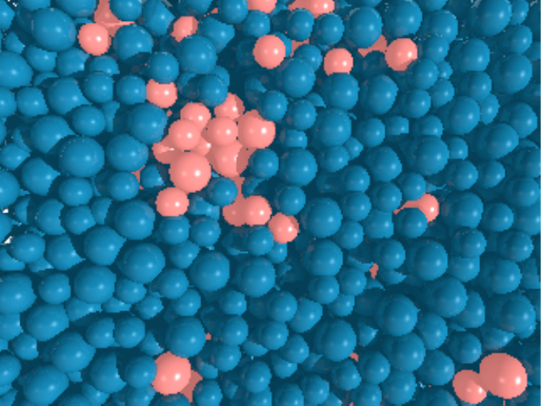
  

    
Spatial and Temporal Dynamical Heterogeneities Approaching the Binary Colloidal Glass Transition

    
Near the colloidal glass transition, mobile particles (red) cluster into large cooperative regions while most of the sample is arrested (blue). The four-point susceptibility &#967;&#8324; quantifies this growing spatial and temporal heterogeneity.

    <a class="prt-link" href="projects/four-point-colloids.html">Details →</a>
  

<!-- TAB 4: WAVE MECHANICS -->

  
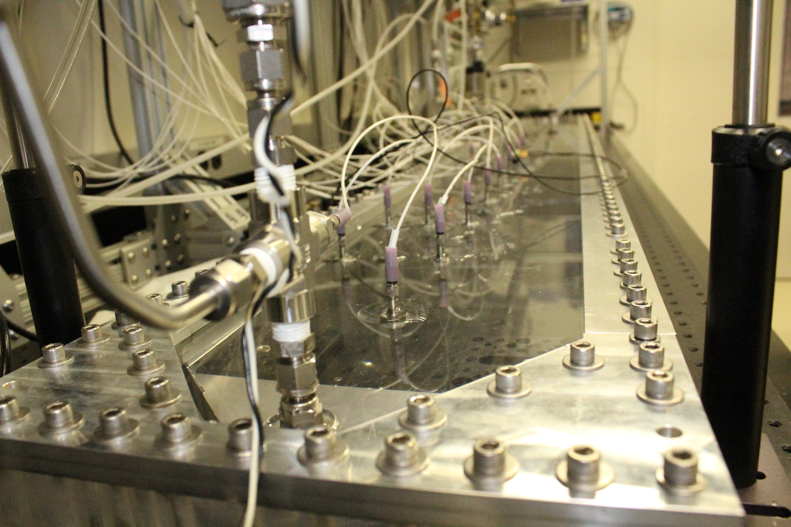

  

    
Wave Propagation in Fractures

    
Generating and monitoring acoustic Krauklis waves in synthetic fractures to probe fracture geometry and fluid content — with applications to geophysical monitoring.

    <a class="prt-link" href="KrauklisWaves/">Details →</a>
  

<!-- TAB 5: ADHESION -->

  
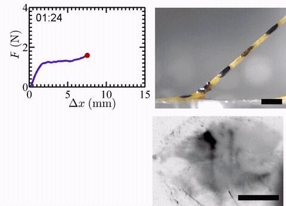

  

    
Dynamics of Mussel Plaque Detachment

    
Plastic yielding of the mussel plaque and mushroom-shaped holdfast geometry together provide a 100–1000× enhancement in bond strength over chemistry alone, revealed by a custom dual-imaging load frame.

    <a class="prt-link" href="projects/mussel-plaque-detachment.html">Details →</a>
  

---

## 📚 Publications & Patents

### Publications

| #  | Title                                                                                                                                                             | Year |
| -- | ----------------------------------------------------------------------------------------------------------------------------------------------------------------- | :--: |
| 14 | [**Clogging and avalanches in quasi-2D emulsion hopper flow**](https://doi.org/10.1103/PhysRevE.105.014603) *X. Hong, K.W. Desmond, D. Chen, E.R. Weeks.* Phys. Rev. E 105(1), 014603 | 2022 |
| 13 | [**Encoded injection of microbubbles to improve flow velocity measurements using cross-correlation technique**](https://doi.org/10.1088/1361-6501/abe96b) *K.W. Desmond, G.L. Hunter.* Meas. Sci. Technol. 32(8), 085302 | 2021 |
| 12 | [**3D generalized finite element method for wave propagation in fluid-filled fractures**](https://doi.org/10.1016/j.cma.2021.114136) *N. Shauer, K.W. Desmond, P.A. Gordon, F. Liu, C.A. Duarte.* CMAME 386, 114136 | 2021 |
| 11 | [**Sensitivity of coda wave interferometry to fluid migration through rock**](https://doi.org/10.1121/1.5091697) *K.W. Desmond, J.J. Valenza.* J. Acoust. Soc. Am. 145(2), 1100–1104 | 2019 |
| 10 | [**Experimental observation of local rearrangements in dense quasi-2D emulsion flow**](https://doi.org/10.1103/PhysRevE.91.062306) *D. Chen, K.W. Desmond, E.R. Weeks.* Phys. Rev. E 91(6), 062306 | 2015 |
| 9  | [**Dynamics of mussel plaque detachment**](https://doi.org/10.1039/C5SM01072A) *K.W. Desmond, N.A. Zacchia, J.H. Waite, M.T. Valentine.* Soft Matter 11(34), 6832–6839 | 2015 |
| 8  | [**Measurement of stress redistribution in flowing emulsions**](https://doi.org/10.1103/PhysRevLett.115.098302) *K.W. Desmond, E.R. Weeks.* Phys. Rev. Lett. 115(9), 098302 | 2015 |
| 7  | [**Influence of particle size distribution on random close packing of spheres**](https://doi.org/10.1103/PhysRevE.90.022204) *K.W. Desmond, E.R. Weeks.* Phys. Rev. E 90(2), 022204 | 2014 |
| 6  | [**Rheology of fluidized granular matter**](https://doi.org/10.1103/PhysRevE.88.032202) *K.W. Desmond, U. Villa, M. Newey, W. Losert.* Phys. Rev. E 88(3), 032202 | 2013 |
| 5  | [**Experimental study of forces between quasi-2D emulsion droplets near jamming**](https://doi.org/10.1039/C3SM27287G) *K.W. Desmond, P.J. Young, D. Chen, E.R. Weeks.* Soft Matter 9(12), 3424–3436 | 2013 |
| 4  | [**Stress fluctuations in 2D hopper flow**](https://doi.org/10.1039/C2SM26023A) *D. Chen, K.W. Desmond, E.R. Weeks.* Soft Matter 8(40), 10486–10492 | 2012 |
| 3  | [**Dynamical heterogeneities near colloidal glass transition**](https://doi.org/10.1039/C0SM00756K) *T. Narumi, S.V. Franklin, K.W. Desmond, M. Tokuyama, E.R. Weeks.* Soft Matter 7(4), 1472–1482 | 2011 |
| 2  | [**Random close packing in confined geometries**](https://doi.org/10.1103/PhysRevE.80.051305) *K.W. Desmond, E.R. Weeks.* Phys. Rev. E 80(5), 051305 | 2009 |
| 1  | [**Jamming of three-dimensional prolate granular materials**](https://doi.org/10.1103/PhysRevE.73.031306) *K. Desmond, S.V. Franklin.* Phys. Rev. E 73(3), 031306 | 2006 |

### Patents

| # | Title                                                                                                                                                                                      | Year |
| - | ------------------------------------------------------------------------------------------------------------------------------------------------------------------------------------------ | :--: |
| 5 | **Systems and methods for measuring cluster efficiency using broadband tube waves** *B.D. Wheelock, P.A. Gordon, L. Song, K.W. Desmond, Y. Zhang.* US Pat. 12,130,399                   | 2024 |
| 4 | **Estimates of flow velocity with controlled spatio-temporal variations in contrast media properties** *K.W. Desmond, G.L. Hunter.* US Pat. 11,573,108                                  | 2023 |
| 3 | **Method and system for performing wireless ultrasonic communications along tubular members** *T.F. Kinn, X. Yi, S.W. Clawson, M.M. Disko, K.W. Desmond, J.H. Moss.* US Pat. 11,203,927 | 2021 |
| 2 | **Estimating flow velocity in pipes by correlating multi-frequency signals** *K.W. Desmond, G.L. Hunter.* US Pat. App. 16/190,734                                                       | 2019 |
| 1 | **Electrode materials with mixed particle sizes** *Z.C. Tim Holme, K. Desmond, W\.A. Hermann, J. Han.* US Pat. 20,150,357,644                                                           | 2015 |

## 🎓 Education

| Degree              | Institution                             |   Year  | Advisor                                                                  |
| ------------------- | --------------------------------------- | :-----: | ------------------------------------------------------------------------ |
| PhD Physics         | Emory University                        |   2012  | [Eric R. Weeks](https://faculty.college.emory.edu/sites/weeks/)          |
| BSc (Physics)       | Rochester Institute of Technology       |   2006  | [Scott V. Franklin](https://www.rit.edu/directory/svfsps-scott-franklin) |
| Postdoctoral Fellow | University of California, Santa Barbara | 2012–14 | [Megan J. Valentine](https://valentine.me.ucsb.edu/)                     |

**Google Scholar profile:**  

🔗 [Google Scholar](https://scholar.google.com/citations?user=KqSFejcAAAAJ&hl=en) 

## 🏷 Connect

<h3>Site Index</h3>

<ul>
<li><a href="/projects/forces-between-2d-droplets.html">Forces Between Quasi-2D Emulsion Droplets Near Jamming</a></li>
<li><a href="/projects/stress-propagation-2d-emulsion.html">Stress Redistribution in Flowing Dense Emulsions</a></li>
<li><a href="/projects/granular-flow.html">Penetration of an Object into Granular Media</a></li>
<li><a href="/projects/jamming-of-rods.html">Jamming of Three-Dimensional Prolate Granular Materials</a></li>
<li><a href="/projects/granular-rheology.html">Rheology of Fluidized Granular Matter</a></li>
<li><a href="/projects/rcp-algorithm.html">Random Close Packing Algorithm</a></li>
<li><a href="/projects/confined-rcp.html">Random Close Packing in Confined Geometries</a></li>
<li><a href="/projects/rcp-polydispersity.html">Influence of Particle Size Distribution on RCP</a></li>
<li><a href="/projects/ellipsoidal-packing.html">Ellipsoidal Packing</a></li>
<li><a href="/projects/ellipsoidal-diffusion.html">Ellipsoidal Diffusion Microrheology</a></li>
<li><a href="/projects/four-point-colloids.html">Dynamical Heterogeneities in Colloidal Glass</a></li>
<li><a href="/KrauklisWaves/">Wave Propagation in Fractures</a></li>
<li><a href="/projects/mussel-plaque-detachment.html">Dynamics of Mussel Plaque Detachment</a></li>
</ul>

*Last updated: 2026-03-17*  

